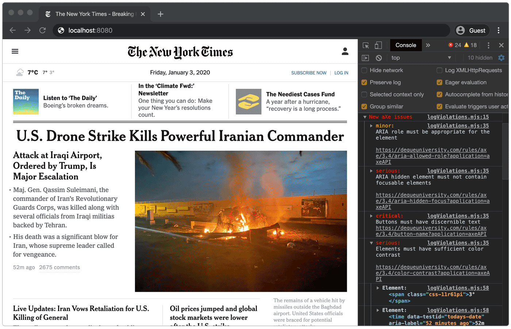

# Agnostic Axe

Agnostic Axe logs accessibility issues to the browser console, as you develop your app. Its audits are powered by [axe-core](https://github.com/dequelabs/axe-core).



## Basic Usage

To get started, import Agnostic Axe. Once initialized, it will continuously monitor the DOM for accessibility issues.


```js
import('https://unpkg.com/agnostic-axe@2').then(
  ({ AxeObserver, logViolations }) => {
    const MyAxeObserver = new AxeObserver(logViolations)
    MyAxeObserver.observe(document)
  }
)
```

> Be sure to only import Agnostic Axe in your development environment. Else your application will use more resources than necessary when in production. ([See an example of how to do this for webpack](WEBPACK_EXAMPLE.MD))

> To try out Agnostic Axe on any site, simply paste the above code into the browser console.

## API Details

The `AxeObserver` constructor takes two parameters:

- `violationsCallback` (required). A function that is invoked with an array of violations, as reported by [axe-core](https://github.com/dequelabs/axe-core). To log violations to the console in a nice format, simply pass the `logViolations` function exported by this module.
- `options` (optional). An object with that supports the following configuration keys:
  - `axeCoreConfiguration` (optional). [A configuration object for axe-core](https://github.com/dequelabs/axe-core/blob/master/doc/API.md#api-name-axeconfigure). Overwrites the default configuration used by agnostic axe.
  - `axeCoreInstanceCallback` (optional). A callback that is invoked with the [axe-core](https://github.com/dequelabs/axe-core) instance.

The `AxeObserver.observe` method takes one parameter:

- `targetNode` (required). A DOM node. AxeObserver audits this node, and continously monitors it for changes. If a change has been detected, AxeObserver audits the parts that have changed, and reports any new accessibility defects.

To observe multiple nodes, one can call the `AxeObserver.observe` method multiple times.

Note that due to limitations imposed by [axe-core](https://github.com/dequelabs/axe-core), there should never be more than one instance of AxeObserver in the same enviroment.

```js
MyAxeObserver.observe(document.getElementById('react-main'))
MyAxeObserver.observe(document.getElementById('vue-header'))
MyAxeObserver.observe(document.getElementById('page-footer'))
```

To stop observing changes, invoke the `disconnect` method.

```js
MyAxeObserver.disconnect()
```

## Comparison with react-axe

Unlike framework specific implementations of [axe-core](https://github.com/dequelabs/axe-core), such as [react-axe](https://github.com/dequelabs/react-axe), agnostic axe uses a [MutationObserver](https://developer.mozilla.org/en-US/docs/Web/API/MutationObserver) to listen for changes directly in the DOM. This has two advantages:

1. It always works with all web frameworks, and with any versions. For example, at the time of writing, [react-axe](https://github.com/dequelabs/react-axe) does not work with the newer React function components or fragments, while agnostic axe does supports them.
2. It only runs audits if the actual DOM changes. This means it uses less resources than [react-axe](https://github.com/dequelabs/react-axe), which runs audits when components rerender, even if their output does not change.

Agnostic axe is optimized for performance. Its audits are small chunks of work, that are run in the browser's idle periods.
