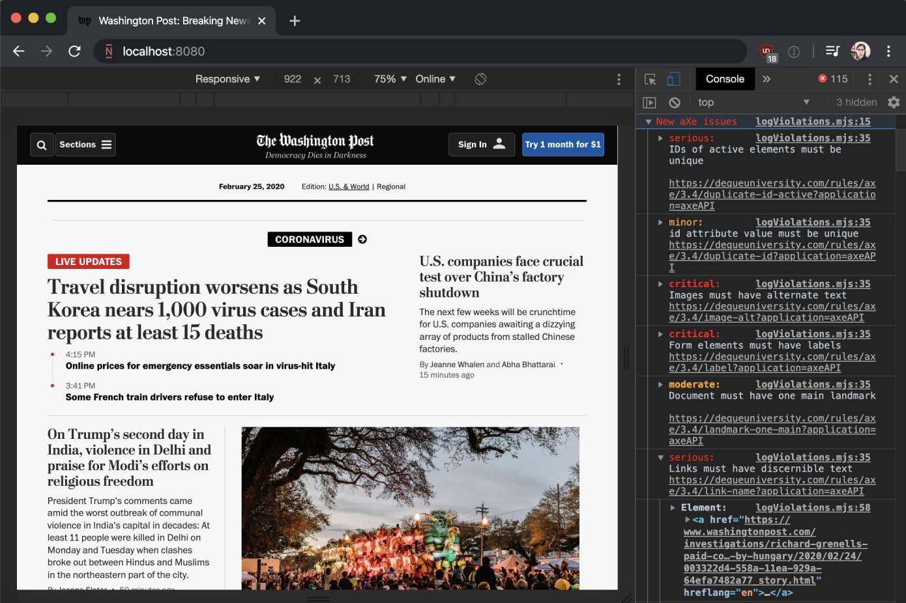

# agnostic-axe

Developer tool that continously observes the DOM to detect accessibility issues. Its audits are powered by [axe-core](https://github.com/dequelabs/axe-core).



## Basic Usage

This is all you need to start reporting accessibility issues to the browser console:

```js
import('https://unpkg.com/agnostic-axe@3').then(
  ({ AxeObserver, logViolations }) => {
    const MyAxeObserver = new AxeObserver(logViolations)
    MyAxeObserver.observe(document)
  }
)
```

> To try agnostic-axe, paste the above code into the browser console on a site of your choosing.

When adding agnostic-axe to your project, be sure to only import it in your development environment. Else your application will use more resources than necessary. ([Here's an example of how to do this with webpack](WEBPACK_EXAMPLE.MD))

## API Details

### AxeObserver constructor

Accepts one parameter:

- `violationsCallback` (required). A function that is invoked with an array of violations, as reported by [axe-core](https://github.com/dequelabs/axe-core). To log violations to the console, simply pass the `logViolations` function exported by this module.

### AxeObserver.observe

Accepts one parameter:

- `targetNode` (required). A DOM node. AxeObserver audits this node, and continously monitors it for changes. If a change has been detected, AxeObserver audits the parts that have changed, and reports any new accessibility defects.

To observe multiple nodes, one can call the `AxeObserver.observe` method multiple times.

```js
MyAxeObserver.observe(document.getElementById('react-main'))
MyAxeObserver.observe(document.getElementById('vue-header'))
MyAxeObserver.observe(document.getElementById('page-footer'))
```

### AxeObserver.disconnect

Accepts no parameters.

Invoke this method to stop observing the DOM. This also clears the cache of violations that were already reported.

```js
MyAxeObserver.disconnect()
```

### Interacting with the axe-core API

The instance of axe-core used by agnostic-axe is exported by this module. Import it to interact with the [axe-core API](https://github.com/dequelabs/axe-core/blob/develop/doc/API.md).

```js
import('https://unpkg.com/agnostic-axe@3').then(
  ({ axeCoreInstance, AxeObserver, logViolations }) => {
    axeCoreInstance.registerPlugin(myPlugin)
    // ...
  }
)
```

## Comparison with react-axe

Unlike framework specific implementations of [axe-core](https://github.com/dequelabs/axe-core), such as [react-axe](https://github.com/dequelabs/react-axe), agnostic-axe uses a [MutationObserver](https://developer.mozilla.org/en-US/docs/Web/API/MutationObserver) to listen for changes directly in the DOM. This has two advantages:

1. It works with all web frameworks, and with any of their versions. This is key, as for example, at the time of writing, [react-axe](https://github.com/dequelabs/react-axe) does not work with the newer React features (function components and fragments), while agnostic-axe does supports them.
2. It only runs audits if the actual DOM changes. This means it uses less resources than [react-axe](https://github.com/dequelabs/react-axe), which runs audits when components rerender, even if their output does not change.

agnostic-axe is optimized for performance. Its audits are small chunks of work that run in the browser's idle periods.
